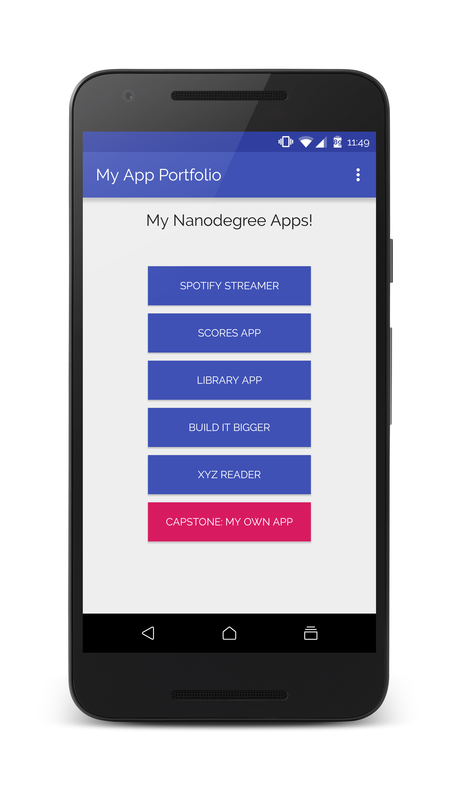

# My App Portfolio
Portfolio app developed by me for the introduction stage of Android Nanodegree Program.

App includes buttons with the names of applications, which will be developed during Android Nanodegree Program. Buttons respond to click event displaying the toast message including the names of the buttons.

## Screenshots

## Android Developer Nanodegree
[![udacity][1]][2]

[1]: screenshots/nanodegree.png
[2]: https://www.udacity.com/course/android-developer-nanodegree--nd801

## License

    Copyright 2015 Orkhan Gasimli

    Licensed under the Apache License, Version 2.0 (the "License");
    you may not use this file except in compliance with the License.
    You may obtain a copy of the License at

        http://www.apache.org/licenses/LICENSE-2.0

    Unless required by applicable law or agreed to in writing, software
    distributed under the License is distributed on an "AS IS" BASIS,
    WITHOUT WARRANTIES OR CONDITIONS OF ANY KIND, either express or implied.
    See the License for the specific language governing permissions and
    limitations under the License.